# Introdução

> **Nota**: Certifique-se de ter concluído as instruções do [Configuração do Ambiente - React Native](https://reactnative.dev/docs/environment-setup) até a etapa "Criando um novo aplicativo" antes de prosseguir.

## Passo 1: Iniciar o Servidor Metro

Primeiro, você precisará iniciar o **Metro**, o _bundler_ JavaScript que acompanha o React Native.

Para iniciar o Metro, execute o seguinte comando a partir da **raiz** do seu projeto React Native:

```bash
# usando npm
npm start

# OU usando Yarn
yarn start
```

## Passo 2: Iniciar seu Aplicativo

Deixe o Metro Bundler rodando em seu próprio terminal. Abra um **novo** terminal na **raiz** do seu projeto React Native e execute o seguinte comando para iniciar seu app no **Android** ou **iOS**:

### Para Android

```bash
# usando npm
npm run android

# OU usando Yarn
yarn android
```

### Para iOS

```bash
# usando npm
npm run ios

# OU usando Yarn
yarn ios
```

Se tudo estiver configurado corretamente, seu novo app deve começar a rodar no **Emulador Android** ou no **Simulador iOS** em breve, desde que os emuladores estejam corretamente configurados.

Este é um modo de executar seu aplicativo — você também pode rodá-lo diretamente no Android Studio ou no Xcode.

---

# Sobre o Aplicativo

O aplicativo ainda está em desenvolvimento. 

O próximo passo será a implementação do backend para fornecer suporte às funcionalidades e integração com serviços externos.

---

## Telas do APP - NutriVerde
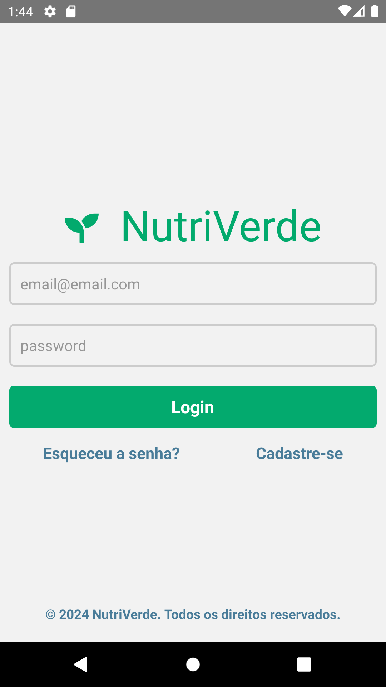
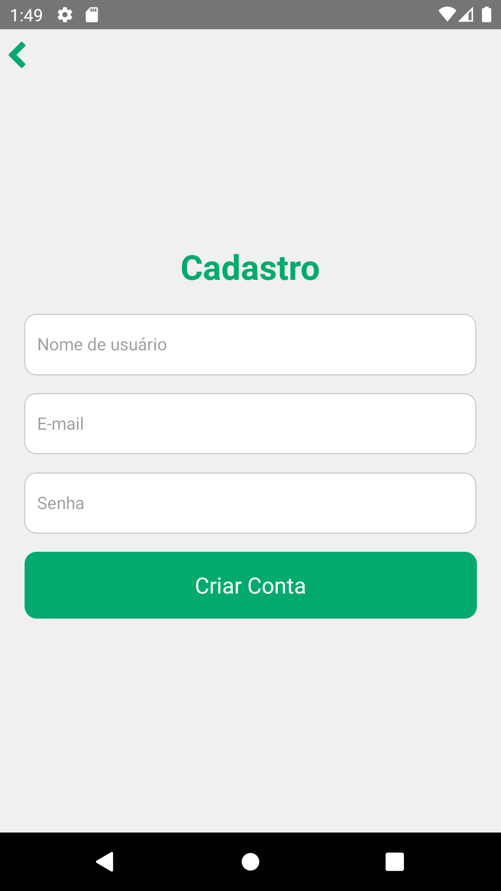
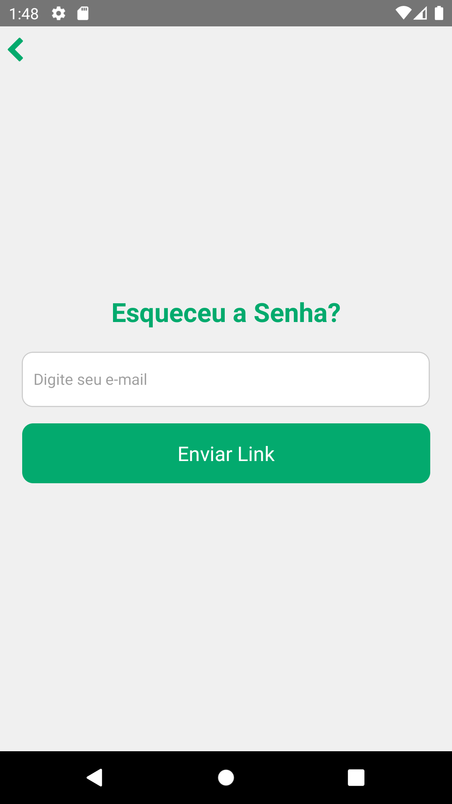
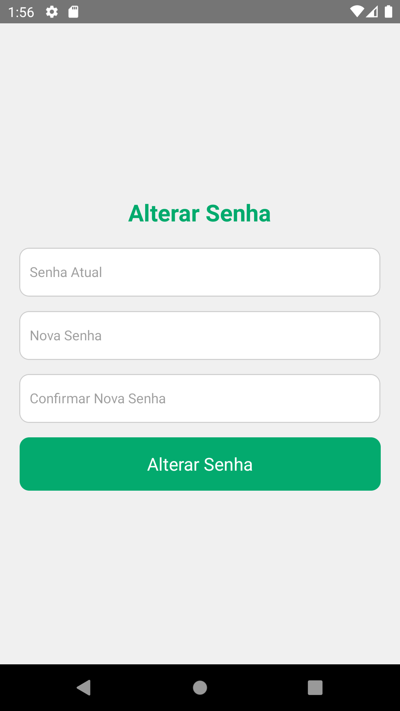
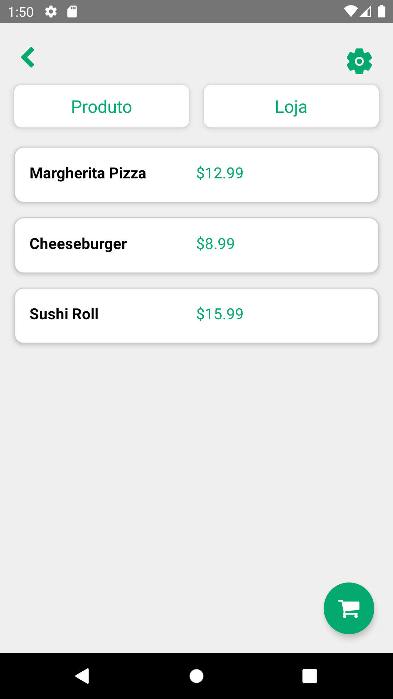
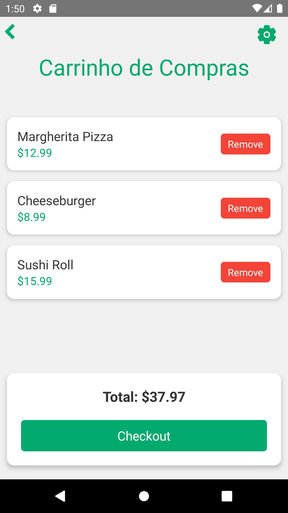
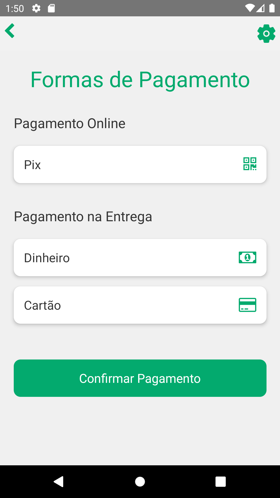
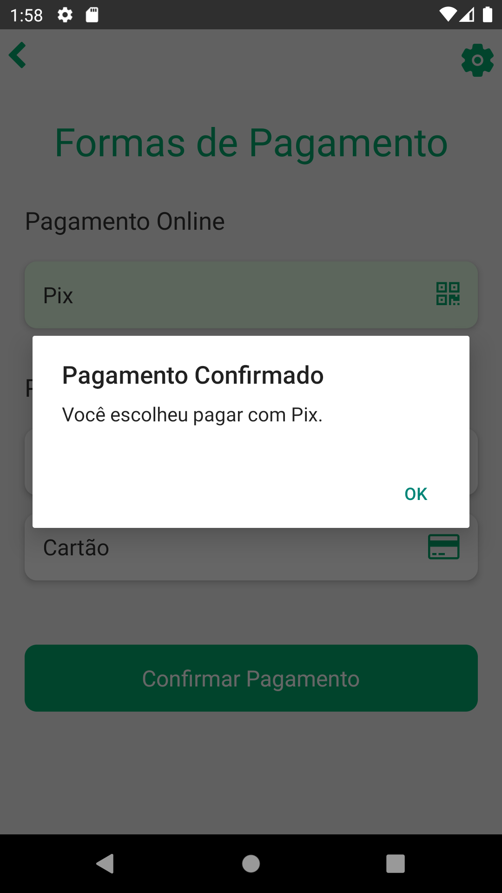
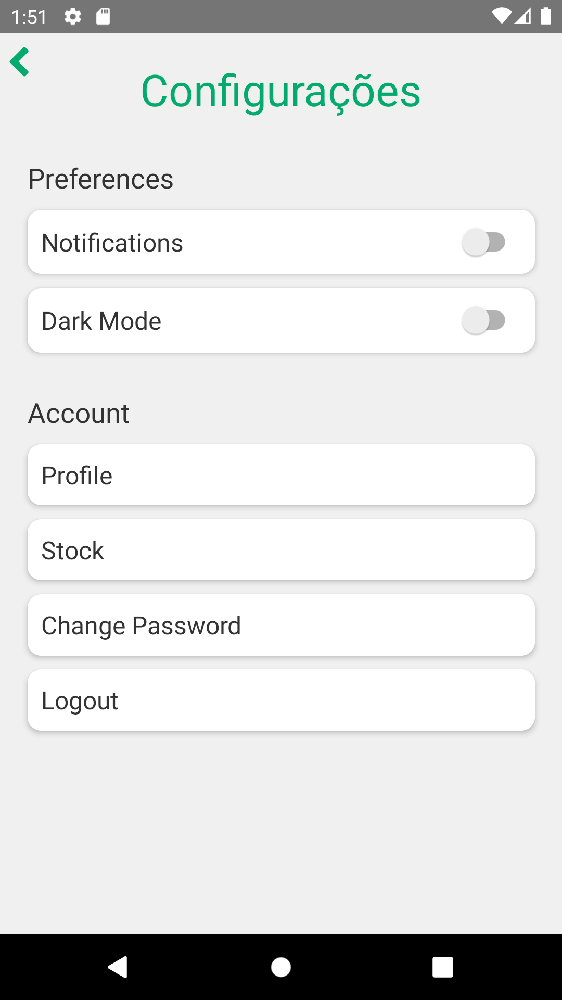
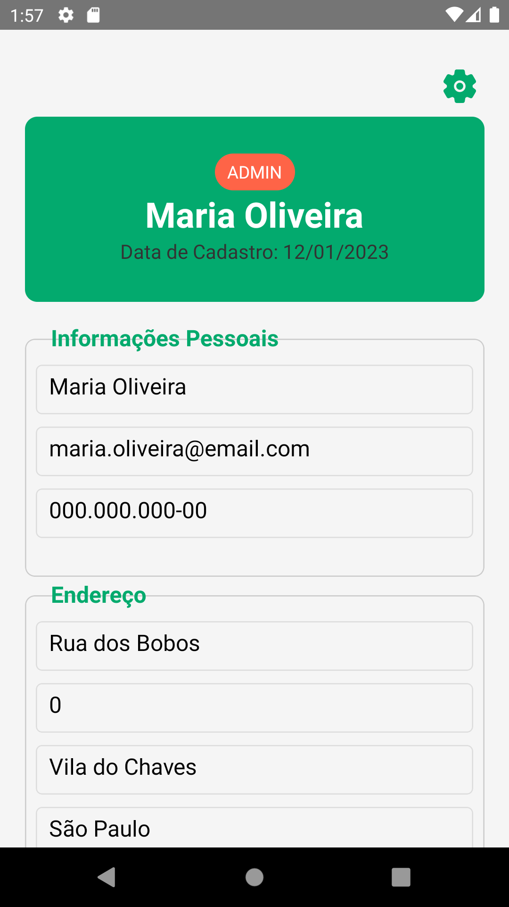
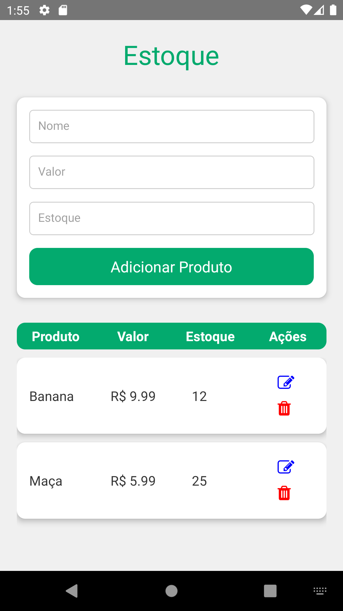
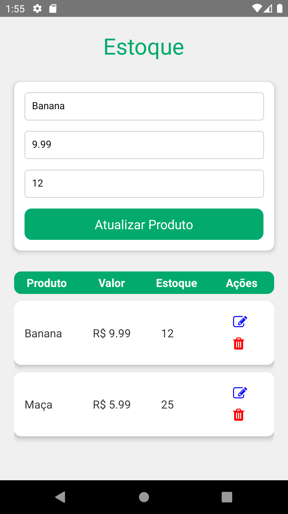


---

